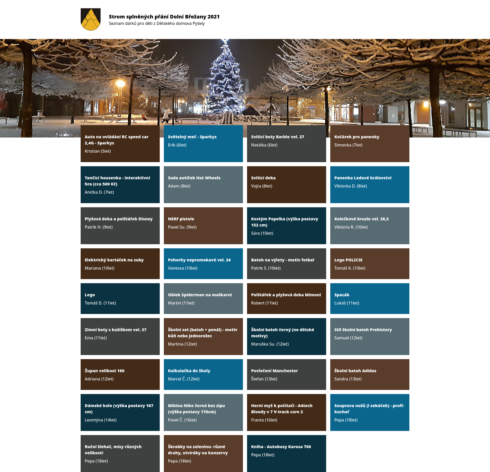
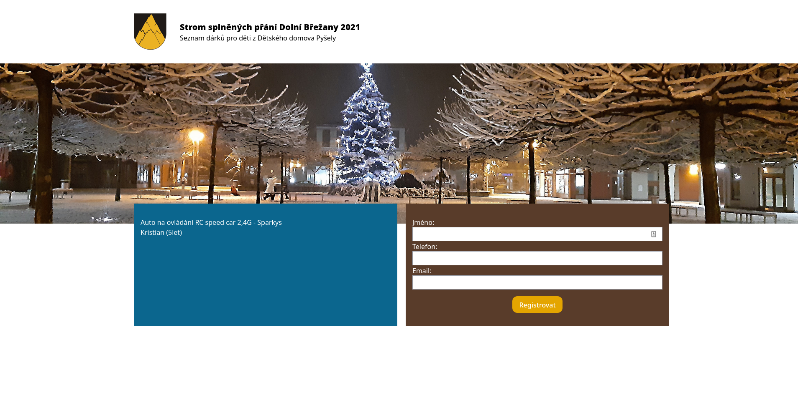

[](https://wakatime.com/badge/github/marekvospel/Strom-Splnenych-Prani)  
# Strom Splněných Přání
Every year, in Dolní Břežany, there was an event, where a Christmas tree was lit. During this event, people can register to give a small gift to a child from an orphanage in Pyšely, the kid really wanted.  
Sadly because of this year's COVID-19 situation, this event has been cancelled, so this website has been created, so people can register for this online.  
  
This project has been created in 3 days using Firebase, TailwindCSS and SvelteKit.

## Building
### Requirements
Node 14+, Yarn
### Building
```bash
yarn install
yarn build
```
This project uses `@sveltejs/adapter-auto`. If you want to build a node script or a static site, you will have to either modify adapters.js or change adapter to `@sveltejs/adapter-node` or `@sveltejs/adapter-static` inside svelte.config.js

## Screenshots

[]()
[]()
